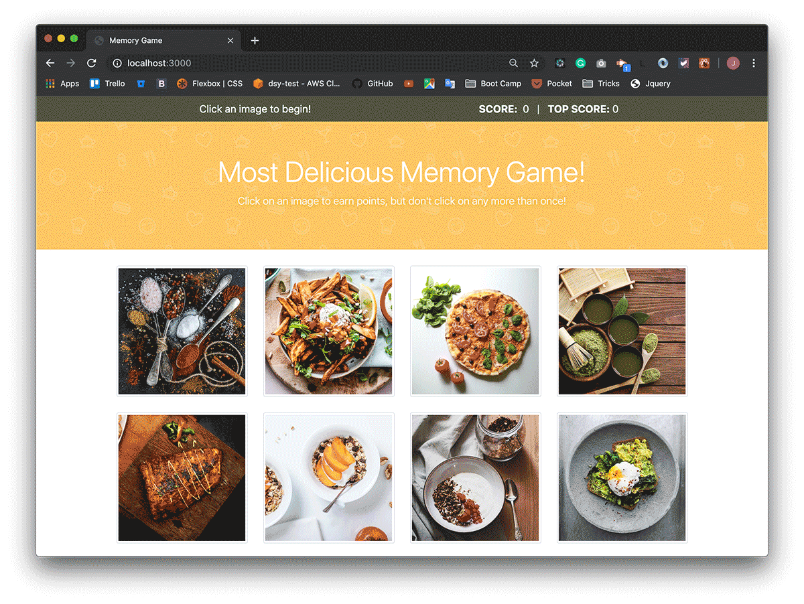

## Memory Game

This project is a memory game created with React. The main goal of this assignment was create different UI components, manage component state, and respond to user events.

Play the game here:
https://coti-garcia.github.io/react-memory-game/
[GitHub Page](https://coti-garcia.github.io/react-memory-game/)

Format: ![GIF]

### Run this proyect on development mode:

- npm install
- yarn start or npm start
